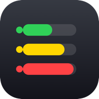

<p align="center">
  
</p>

<h1 align="center">Claude Session Monitor</h1>

<p align="center">
  Una utilidad nativa de <b>barra de menús</b> para macOS que monitorea en tiempo real
  todas tus sesiones de <b>Claude Code</b>: contexto usado, agentes en vivo, estado y más.
  <br/>Sin dependencias, sin red — lee solo los datos locales de <code>~/.claude</code>.
</p>

<p align="center">
  <i>Hecho con Claude Code 🤖 · multi-idioma (en/es/pt)</i>
</p>

---

## ✨ Características

- **Contexto por sesión** con barra de color: 🟢 verde (<40%), 🟡 amarillo (40–70%), 🔴 rojo (>70%).
- **Agentes en vivo** por sesión: nombre, **tiempo de ejecución** (reloj que avanza) y **tokens**.
- **Estado real** leyendo el proceso: **Activa**, **Dormida** (ventana abierta, inactiva) o **Cerrada**, agrupadas con encabezado.
- **Tendencia** del contexto con mini-gráfico, y **alerta** con sonido al entrar en rojo.
- **Nombre y color** que le pusiste a la sesión en Claude Code (`/rename`, `/color`).
- **Estado del control remoto** (conectado / desconectado) por sesión.
- **Saltar a la ventana**: enfoca la pestaña exacta de la terminal que hospeda la sesión.
- **Personalización por sesión** (en el monitor): color, alias, fijar arriba, ocultar.
- **Reflejar cambios en Claude** (opcional): teclea `/color` / `/rename` en la terminal de la sesión.
- **Preferencias** con ventana propia (Settings / About) y **multi-idioma** alineado con el OS.
- **Eficiente**: escaneo en segundo plano + caché por `mtime` (no re-lee lo que no cambió).

## 📦 Requisitos

- macOS 13+ (probado en macOS 26)
- Swift / Command Line Tools (`xcode-select --install`)

## 🔨 Compilar e instalar

```bash
git clone https://github.com/wmachuca/claude-session-monitor.git
cd claude-session-monitor
./build.sh
open ClaudeSessionMonitor.app
```

`build.sh` compila, empaqueta el `.app` y lo firma con una identidad estable propia
(se crea sola la primera vez) para que los permisos de macOS persistan entre recompilaciones.

**Iniciar al arrancar:** actívalo desde **Preferencias → Settings → «Iniciar al arrancar el equipo»**
(usa `SMAppService`, la API moderna de macOS). También puedes hacerlo a mano en
Ajustes del sistema → General → Ítems de inicio.

## 🚀 Cómo usarlo

### El ícono de la barra
Arriba a la derecha aparece un ícono que **cambia de forma y color** según la sesión más
cargada (círculo/triángulo/octágono · verde/amarillo/rojo) junto al número de sesiones activas.

### Al hacer clic — lista de sesiones
Las sesiones se agrupan por estado y se ordenan **Activas → Dormidas → Cerradas**
(las fijadas 📌 van primero):

```
2 sesión(es) activa(s) · 7 reciente(s)
──────────────────────────────────────
ACTIVAS · 1
🟢 Development          ▕█████▉░░▏ 64% ↑  🤖2
──────────────────────────────────────
DORMIDAS · 5
💤 Issues               ▕██░░░░░░▏ 24% →
💤 Infrastructure       ▕████░░░░▏ 41% →
──────────────────────────────────────
CERRADAS · 1
⏸ vecinity-auth         ▕███████░▏ 88%
```

Cada fila muestra: marcador de color · **nombre** · barra de **contexto** · **%** · **tendencia** (↑↓→) ·
`🤖N` agentes corriendo · luz verde si está procesando.

### Submenú de cada sesión (pasa el cursor encima)
```
📋 Implementando fix #342               ← tarea in_progress
Contexto: 640.3k / 1000k  (64%)
Estado: ⚙ Procesando…
Control remoto: conectado 📡
Modelo: opus-4-8
Tendencia: ▁▂▃▅▆▇ (gráfico)
↗ Ir a la ventana de esta sesión        ← salta a la pestaña de Terminal/iTerm
──────────────────────────────
Agentes activos (2)
  ▶ dev-android  Implementar #49   12m 11s   ↓ 160k tok
  ▶ dev-ios      Implementar #39   11m 53s   ↓ 174k tok
──────────────────────────────
En el monitor                            ← ajustes locales (no tocan Claude)
  ● Color ▸
  ✏️ Renombrar (alias)…
  📌 Fijar arriba
  🙈 Ocultar del monitor
```

- **Ir a la ventana**: enfoca la pestaña exacta de la terminal (Terminal.app / iTerm2; otras: activa la app).
- **En el monitor**: color / alias / fijar / ocultar se guardan **en el monitor** (indexado por `sessionId`).
- Las ocultas aparecen abajo en **"Sesiones ocultas (N)"** con opción de mostrarlas.

### Preferencias (⌘,)
Ventana propia con dos pestañas:
- **Settings**: intervalos, umbrales de color, ventana de contexto, **idioma**, notificaciones, etc.
- **About**: versión, enlace a GitHub, carpeta del proyecto.

### Reflejar cambios en Claude Code (opcional)
Con el toggle *"Enviar cambios a Claude Code"* activado, al cambiar color/alias en el monitor
también teclea `/color` / `/rename` en la terminal de la sesión (solo si está inactiva).
Requiere permisos de **Automatización** y **Accesibilidad** (la app los solicita la primera vez).

## ⚙️ Configuración

Se edita desde **Preferencias** (o el archivo `~/.config/claude-session-monitor/config.json`):

| Opción | Por defecto | Qué hace |
|---|---|---|
| Refresco | 3 s | cada cuánto escanea |
| Agente «en vivo» | 45 s | umbral para considerar un agente corriendo |
| Sesión activa | 8 min | una sesión cuenta como activa si se usó hace menos |
| Histórico | 90 min | antigüedad máxima para listar una sesión cerrada |
| Umbral verde / amarillo | 40 / 70 % | límites de color |
| Ventana de contexto | Automático | 200k / 1M, o auto |
| Idioma | Sistema | Sistema · English · Español · Português |
| Iniciar al arrancar | no | registra la app como ítem de inicio |
| Notificar en rojo | sí | alerta al superar el umbral |

## 🔍 De dónde salen los datos (todo local)

| Dato | Origen |
|---|---|
| Sesión / contexto / nombre / color | `~/.claude/projects/<proj>/<session>.jsonl` |
| Agentes (tiempo, tokens, en vivo) | `~/.claude/projects/<proj>/<session>/subagents/agent-*.jsonl` |
| Nombre / estado / pid / control remoto | `~/.claude/sessions/*.json` |
| Tarea actual (in_progress) | `~/.claude/tasks/<session>/*.json` |

## 🔒 Privacidad

No usa la red. Solo **lee** archivos locales de `~/.claude` y, opcionalmente, **escribe**
preferencias del propio monitor en `~/.config/claude-session-monitor/`.

## ⚠️ Limitaciones

- La **ventana de contexto** (200k vs 1M) no viene en los transcripts; se infiere (configurable).
- El **color** se refleja desde Claude solo cuando lo pusiste con `/color`; el color automático de "multi-clauding" no se persiste en disco.
- **Controlar el remote control** no es posible localmente (es un canal a la nube); solo se muestra su estado.

## 👤 Autor

**Wilmer Machuca** — [github.com/wmachuca](https://github.com/wmachuca)
